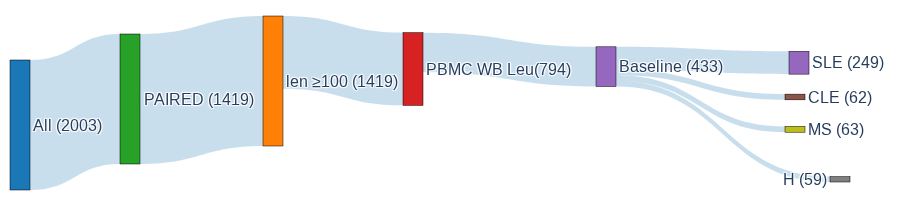
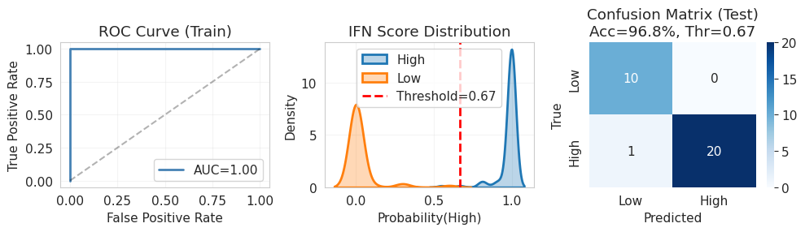
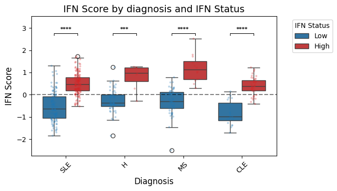
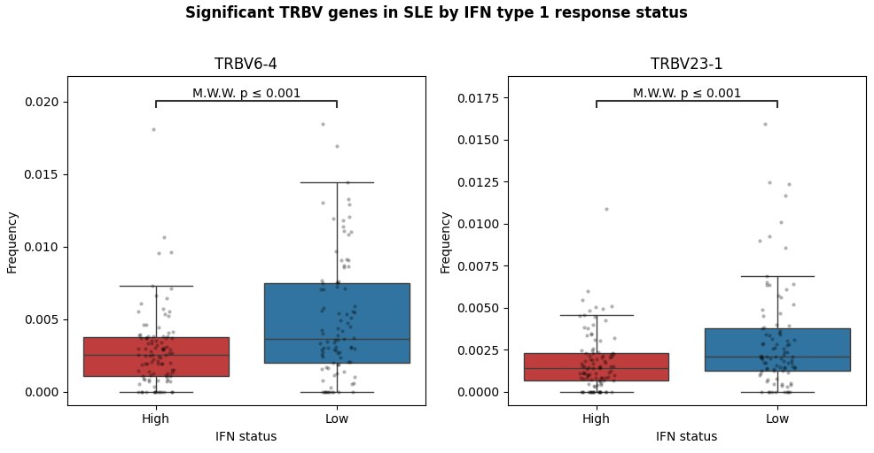
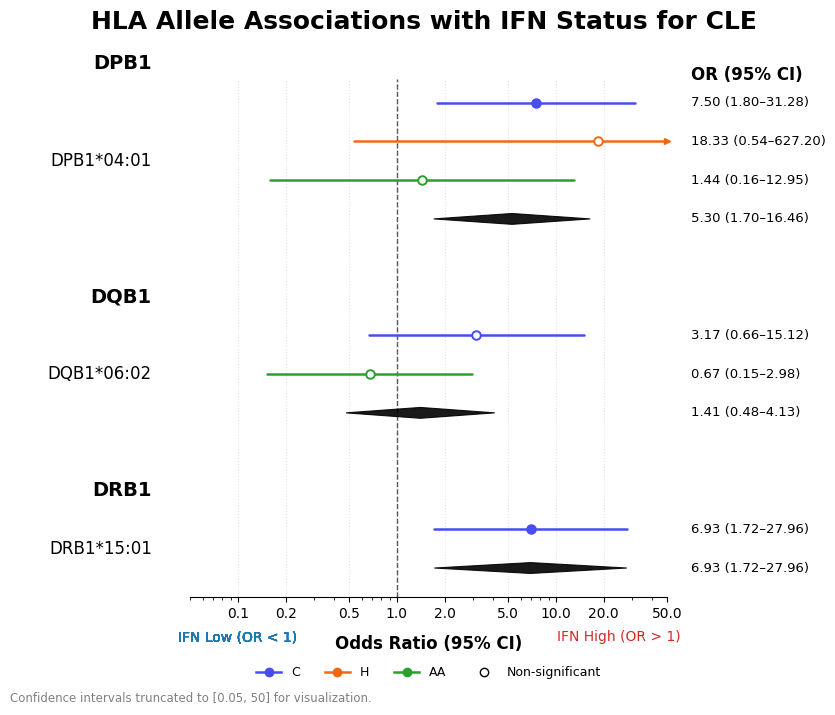

# SKO-1

### Contributors

* **Elena Kokinos**: management, BCR analysis
* **Olga Loginova**: IFN status classification
* **Alexey Senkovenko**: nextflow pipeline, HLA analysis
* **Elizaveta Perepelitsa**: Gene expression analysis 
* **Sergei Losev**: TCR analysis
* **Anastasia Patrusheva**: HLA analysis

Supervisor: **Pavel Skoptsov**

Python version 3.14+ is required.

## Introduction

Multiple sclerosis (MS) and systemic lupus erythematosus (SLE) are chronic autoimmune diseases that differ in their clinical features and underlying mechanisms, but both involve serious immune system dysfunction. Type I interferons (IFNs), particularly interferon-beta (IFN-β), play opposite roles in these conditions. In MS, IFN-β is commonly used as a first-line immunomodulatory treatment that decreases disease activity and reduces the frequency of relapses [[Jakimovski]](https://doi.org/10.1101/cshperspect.a032003). In SLE persistent overactivation of the type I IFN pathway known as the "interferon signature" or interferonopathy is a major factor driving inflammation, the breakdown of immune tolerance, and the production of autoantibodies [[Ishihara]](https://doi.org/10.3390/biom15111586).
Interestingly, both MS and SLE can involve the production of neutralizing autoantibodies against IFN-β. In MS, these antibodies often appear as a result of IFN-β therapy and may reduce how well the treatment works [[Gilli]](https://doi.org/10.1093/brain/awh028). In SLE, they may arise spontaneously as part of the natural autoimmune response [[Grenmyr]](https://doi.org/10.1177/09612033261432154). Still, only a subset of patients in each disease develops these antibodies. Understanding why this heterogeneity exists could help identify shared molecular mechanisms that explain differences in response to interferon and the loss of immune tolerance.


## Nextflow pipeline

### Installation

Check Java installation (must be above Java 11).

```
java -version
```

If Java is not installed.
```
curl -s https://get.sdkman.io | bash
sdk install java 17.0.10-tem
java -version 
```
Install Nextflow in separate conda environment using [official guide](https://docs.seqera.io/nextflow/install#conda)

The pipeline was adapted to the latest Nextflow version [v. 26.04.0](https://doi.org/10.1038/nbt.3820).

### Tree of pipeline:
	
```
├── bin
│   └── download_fastq_from_csv.sh
├── envs
│   ├── arcashla.yaml
│   ├── download_aria.yaml
│   ├── fastp.yaml
│   ├── kallisto.yaml
│   ├── mixcr.yaml
│   ├── star.yaml
│   └── trust4.yaml
├── main.nf
├── modules
│   ├── MIXCR.nf
│   ├── TRUST4.nf
│   ├── arcasHLA.nf
│   ├── download_aria.nf
│   ├── fastp.nf
│   ├── kallisto.nf
│   └── star.nf
└── nextflow.config
```

* `main.nf` – the core file containing workflow and orchestrating the use of modules.
* `nextflow.config` – the core file with settings for working profiles and executors, contains parameters for running different modules.
* `modules` – separate nf-files with process logic.
* `envs` – .yaml files to build separate conda environments for each tool in workflow.
* `bin` – directory to contain other executable scripts.

Processes include:

* `DOWNLOAD_ARIA` – process to download fastq files by SRR IDs. Uses [aria2](https://aria2.github.io/) as high-speed multiprotocol utility for downloading files.
* `FASTP` – process using [fastp](https://github.com/opengene/fastp) for preprocessing and QC.
* `STAR` – process using [STAR](https://github.com/alexdobin/STAR) splice-aware alignment tool to generate .bam files.
* `MIXCR` – process running [MIXCR](), commercial standard tool for NGS-data analysis. In this project MIXCR is used for clonotype repertoire reconstruction. If a MIXCR license is available, it is recommended to use this module.
* `ARCAS_HLA` – process for HLA typing, uses [arcasHLA](https://github.com/RabadanLab/arcasHLA) tool.

Additional processes:
* `KALLISTO` – process to replace STAR, to save computing resources and retain high-speed. Uses [kallisto](https://github.com/pachterlab/kallisto) pseudoalignment tool.
* `TRUST4` – process that uses [TRUST4](https://github.com/liulab-dfci/TRUST4) for clonotype repertoire reconstruction, can be used as an alternative for MIXCR when license is unavailable.

### Prepare to work
1. Install separate environment for ArcasHLA and add path to IMGTHLA directory to `main.nf`:
```
params.arcasHLAEnv ="../your_path_here"
```
2. If TRUST4 will be used, it is recommended to install it locally and add paths to references to `main.nf`:
```
params.trust4_ref  = "../your_directory/TRUST4/human_IMGT+C.fa"
params.trust4_fa   = "../your_directory/TRUST4/hg38_bcrtcr.fa"
```
Also add path to script within TRUST4.nf.

3. Make directories used by pipeline in your nextflow directory
```
mkdir -p reference reference_star fastqs sample_data results
mkdir -p results/{fastp,fastp_trimmed,star,mixcr,trust4,arcas_hla,multiqc}
```
4. Add sample.csv into sample_data, the format is one column of SRR IDs:
```
SRR7367602
SRR7367603
SRR7367604
SRR7367605
```
5. Run pipeline in its own environment
```
conda activate nextflow_env
nextflow run main.nf
```
Additional flags can be used in run command.
* `-preview` - to check which processes will be run (without running the pipeline)
* `-with-trace` - makes trace file to look-up on progress

By default main.nf runs download > fastp > star. Change the following flags in `main.nf` directly or add `-run_process_name true` in your command to run the process.
```
params.run_download = true
params.run_kallisto = false
params.run_fastp = true
params.run_star   = true
params.run_mixcr   = false
params.run_trust4  = false
params.run_arcashla = false
```

## Data Collection & Cohort


Transcriptomic data for MS and SLE were retrieved from the public repository **Gene Expression Omnibus** ([GEO](https://www.ncbi.nlm.nih.gov/geo/)). From an initial pool of 2,300+ samples, we curated a high-quality cohort based on strict technical and clinical criteria:
- **Sequencing**: paired-end reads, length ≥100 nt.
- **Source**: peripheral blood (to capture diverse immune populations).
- **Clinical**: baseline samples only (treatment-naive) to minimize confounding.
The final cohort (n = 433) included data from the following GEO accession numbers: GSE159225, GSE122459, GSE167923, GSE139350, GSE162828, GSE165159, GSE169080, GSE175839, GSE218731, GSE223097, GSE250023, GSE92472, GSE86884, GSE235357, GSE250453, and GSE116006.

| Group | Count |
|-------|-------|
| **SLE** | 249 |
| **CLE** | 62 |
| **MS**  | 63 |
| **Healthy Controls** | 59 |





*CLE (cutaneous lupus erythematosus) is a group of heterogeneous autoimmune diseases affecting the skin and mucous membranes. It can occur as an isolated skin lesion or as part of SLE. This study examines it separately from SLE.*

## Classifier

Following alignment with `STAR`, gene read counts were determined using `featureCounts` from the [Subread package](https://subread.sourceforge.net/). Subsequently, gene annotation, filtering, and normalization were performed.


For interferon status prediction (**IFN-High/IFN-Low**)*, we used the following:
- A supervised Random Forest classifier;
- Expression of 9 canonical type I interferon response genes (*IFI27, IFIT1, IFIT3, MX1, OAS1, RSAD2, STAT1, IFNAR1, IFNAR2*);
- An SLE patient cohort (GSE116006, n=152) with RT-PCR-confirmed interferon status.


More details can be found in the accompanying [notebook](notebooks/feature_classifier.ipynb).



*Note: The model was validated on the SLE cohort; its application to other conditions (e.g., MS) requires further validation.*


## Gene expression analysis

A key focus of the analysis was evaluating the biological validity of our classification by assessing an Interferon type I (IFN) score. Using a curated set of IFN-inducible genes (IFI27, IFIT1, IFIT3, MX1, OAS1, RSAD2, STAT1, IFNAR1, IFNAR2), we calculated an average expression score, which was Z-scored separately within each dataset to eliminate batch effect. Mann-Whitney U test was applied to compare the IFN scores between the samples predicted as "IFN-High" and "IFN-Low" by our classifier, grouped by diagnosis, as well as by potential technical (RNA type, object) and biological (sex) confounders. The significant difference observed in these scores between "IFN-High" and "IFN-Low" samples supports the biological relevance of the classification. 



Additional gene expression analysis involved calculating similar scores for various immune, matrix, and angiogenesis gene signatures to confirm the integrity of the blood-derived data.

To explore the transcriptomic differences between specific groups, we performed differential gene expression analysis using [DESeq2](https://github.com/thelovelab/DESeq2). In particular, we assessed the differences between healthy controls, as the presence of healthy samples classified as "IFN-High" by our model was unexpected. Notably, these "IFN-High" healthy samples were found in different data sets, eliminating the possibility of a confounding batch effect. Interestingly, only IFN-inducible antiviral genes were differentially expressed between "IFN-High" and "IFN-Low" healthy controls.

Results are summarized in the [notebook](notebooks/expression_analysis.ipynb).


## TCR
T-cell receptor repertoire analysis was based on [MiXCR](https://github.com/milaboratory/mixcr/) clonotype tables generated from .fastq files. Frequency matrices were generated from those tables and we used perMANOVA and pairwise Mann-Whitney criterion with FDR in order to compare V, D and J-segment gene usage profiles between high and low interferon response groups. 

For V-segments of TCR beta chains only 2 genes have shown higher frequencies in SLE samples with Low interferon beta response. This might imply their involvement in anti-interferon beta autoimmune response in SLE, but it should be noted that the effect size is small so these 2 changes are to be regarded as potential candidates with caution. No significant differences have been observed for D- and J-gene usage in the TCR beta-chain.



You can find all the results of this analysis in these 2 notebooks:
[TCR_analysis_diversity.ipynb](notebooks/TCR_analysis_diversity.ipynb)
[TCR_analysis_gene_usage.ipynb](notebooks/TCR_analysis_gene_usage.ipynb)

MiXCR clonotype tables for both TCR and BCR are available at this [link](https://drive.google.com/file/d/1F0lG7-75RYOUBOmnxsbJyyBxJdB44i3N/view?usp=drive_link).

## BCR

BCR repertoire analysis was performed with MiXCR, followed by downstream processing of clonotype tables in a Jupyter notebook. The analysis focused on heavy-chain BCR V(D)J segments and their usage frequencies across samples.

We compared IGHV, IGHD, and IGHJ segment usage between IFN-Low and IFN-High groups in patients with multiple sclerosis, systemic lupus erythematosus, and cutaneous lupus erythematosus. Reduced IFN status was considered a potential proxy for the presence of neutralizing antibodies against type I interferons. For each sample, segment usage frequencies were calculated from MiXCR clonotype tables. Within each diagnostic group, median within-sample frequencies were used to identify the top 10 segments for each segment class. These segments were then compared between IFN-Low and IFN-High groups using a two-sided Mann-Whitney U test with Benjamini-Hochberg FDR correction.

Significant differences were detected only in SLE. To assess whether these signals were consistent across datasets, IFN-Low and IFN-High samples were additionally compared within each GSE separately. This yielded dataset-specific estimates of effect size and direction for each segment.
Among all analyzed segments, only **IGHD3-10** showed a significant and reproducible difference between IFN-Low and IFN-High groups in SLE across independent datasets. No analogous segment-level effects were observed in MS or CLE.

All results are available in:
[BCR_analysis.ipynb](notebooks/BCR_analysis.ipynb)


## HLA typing

To analyze the results of HLA genotyping obtained using arcasHLA, the data were merged into a tsv-table. In the  [notebook](notebooks/hla_analysis.ipynb) for HLA-analysis, there this tsv-table is concatenated with the metadata.

To analyze the results of HLA genotyping obtained using arcasHLA, the data were merged into a tsv-table. In the  [notebook](notebooks/hla_analysis.ipynb) for HLA-analysis, this tsv-table was concatenated with the metadata.

To analyze the results of HLA genotyping, data were divided into ethnic groups, as different ethnicities are characterized by a different set of HLA alleles. Within each ethnic group, the observations were grouped by disease.

All statistical processing methods are combined in the `HLA` class:

1. `count alleles` - calculates the number of occurrences of alleles for each group of *diagnosis-IFN status* for the uploaded batch. The output is a pandas.Dataframe (which is saved as an attribute `allele_counts`) containing the number of carriers of this allele, the number of copies of it, the number of its occurrences in homozygotes and heterozygotes, the number of occurrences of this allele in the *diagnosis-IFN status* group (`n_samples`), as well as the frequency of occurrence in fractions by carriers and the number of copies;
2. Based on `allele_counts`, the Fisher’s exact test and the Chi-Square test can both be applied. However, if an allele has a low expected count (<5) or zero expected frequency when forming the contingency table, the Fisher’s exact test instead of Chi-Square test is applied.
3. Barplots and pie charts are also drawn based on `allele_counts`.

Forest plot is used for meta-analysis, and a separate module is imported to create it.



Specific usage examples are given in [notebook](notebooks/hla_analysis.ipynb) for HLA-analysis.

## References
* D. Jakimovski, C. Kolb, M. Ramanathan, et al., "Interferon β for Multiple Sclerosis," Cold Spring Harb. Perspect. Med., vol. 8, no. 11, pp. a032003, Nov. 2018, doi: 10.1101/cshperspect.a032003.

* R. Ishihara, R. Watanabe, M. Shiomi, et al., "The type I interferon axis in systemic autoimmune diseases: From molecular pathways to targeted therapy," Biomolecules, vol. 15, no. 11, Art. no. 1586, Nov. 2025, doi: 10.3390/biom15111586.

* F. Gilli, A. Bertolotto, A. Sala, F. Hoffmann, M. Capobianco, S. Malucchi, T. Glass, L. Kappos, R. L. Lindberg, and D. Leppert, "Neutralizing antibodies against IFN-β in multiple sclerosis: Antagonization of IFN-β mediated suppression of MMPs," Brain, vol. 127, no. Pt 2, pp. 259–268, Feb. 2004, doi: 10.1093/brain/awh028.

* E. Grenmyr, B. Gullstrand, A. Jern, N. Björklund, R. Kahn, F. Kahn, P. Linge, A. Jönsen, and A. A. Bengtsson, "Neutralizing autoantibodies against interferon alpha in systemic lupus erythematosus: Prevalence, age of onset, and clinical associations," Lupus, vol. 35, no. 6, pp. 623–629, May 2026, doi: 10.1177/09612033261432154.